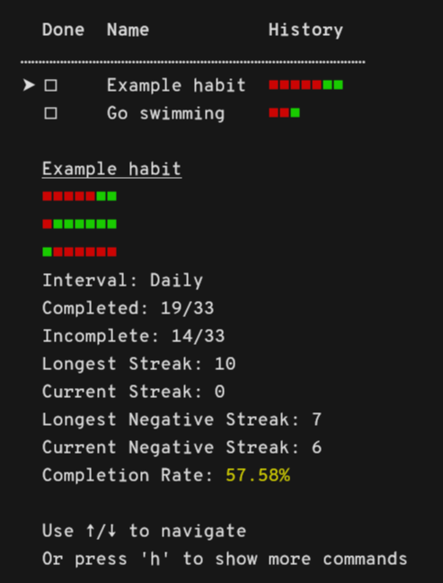

# Habit Tracker

A lightweight, terminal-based habit tracking application build with Python. It
allows users to keep track of different habit types, including daily, weekly,
and monthly habits. The app focuses on fast navigation with Vim-like key binds.
<div>
    <picture>
        
    </picture>
</div>

## 🚀 Getting Started

### Dependencies

- [Python](https://docs.python.org/3/using/index.html)

### Installation

1. Clone the directory

```bash
git clone https://github.com/Skxxtz/habit-tracker.git
```

## 🎛️ Usage

1. Navigate to the habit-tracker directory

```bash
cd /path/to/habit-tracker
```

2. Use python to run `main.py`

```bash
python main.py
```

🎉 You've now successfully started the app.

### Tips

You can show analytics for the current selection. This allows you to show statistics only for the habits that comply with the <filter>.<br>
Example:

1. Press `f` and navigate to "daily"
2. Confirm your selection by pressing `return`
3. Press `I` (shift + i) to show statistics for your daily habits

### Binds

There are several key binds used to navigate the habit tracker.<br>

**Navigation:**

| Bind | Function |
| -------------- | --------------- |
| `j` or `↓` | Navigate down |
| `k` or `↑`| Navigate up |
| `q` or `ctrl + c`| Quit |
| `ctrl + l` | Clear Screen |
| `h` | Show help |

**Habit Management:**

| Bind | Function |
| -------------- | --------------- |
| `c` | Complete habit |
| `r` | Remove habit |
| `o` | Add habit |
| `f` | Filter habits |
| `s` | Sort habits |
| `i` | Show statistics for the current filter selection |
| `I` | Show app-wide statistics |

## 🧪 Tests

To run unit tests, the following command should be run:

```bash
python -m unittest discover tests/
```

Tests exists for the Habit and App class and by extension also the Filter class.
